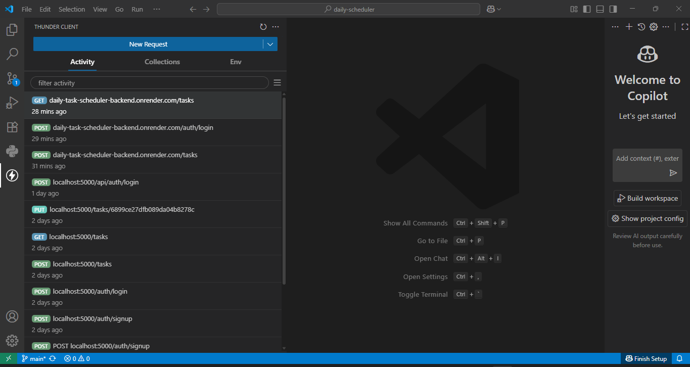
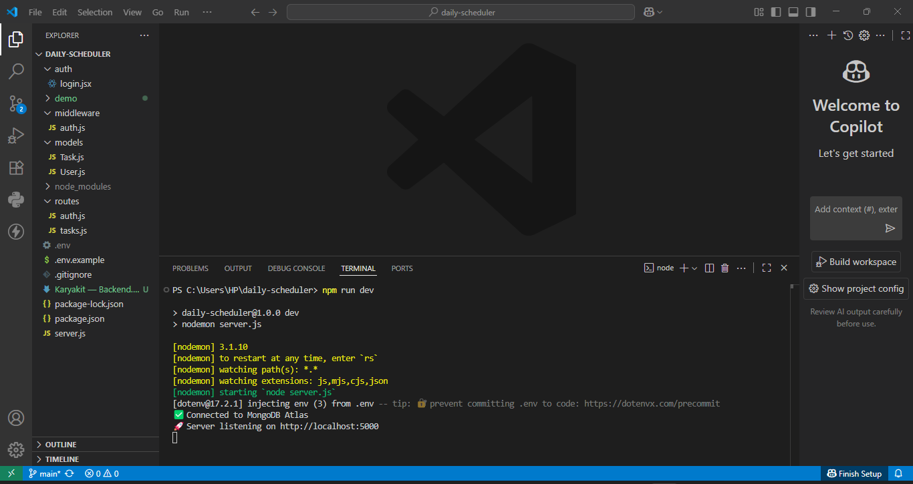
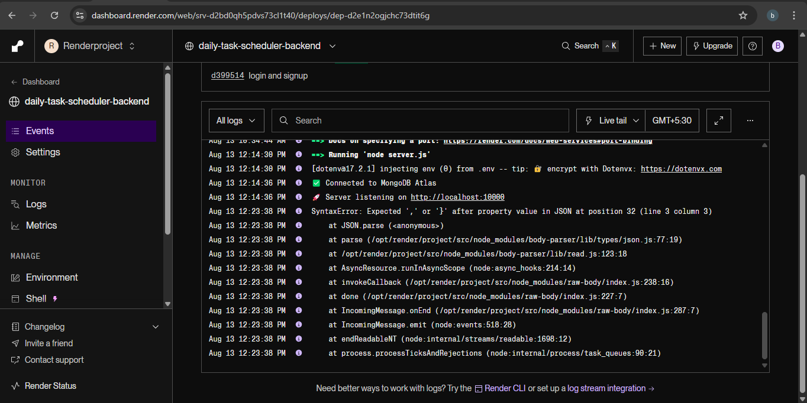

### Karyakit — Backend

Karyakit is a cloud-based task management platform designed to help users organize their daily activities with ease. This repository contains the backend API for the application, built using Node.js and Express, and connected to a MongoDB database for reliable and scalable data storage.

The backend handles all core operations such as creating, reading, and deleting tasks. It is designed to work seamlessly with the Karyakit frontend, providing real-time interaction through a REST API.

##### 

##### Live API

Backend API: https://karyakit-backend.onrender.com  

Frontend: https://karyakit-frontend.netlify.app

##### 

##### Introduction

The Karyakit backend is the backbone of the application, responsible for managing data, processing requests from the frontend, and communicating with the database. It provides a clean, well-structured REST API that can be used by any client application — not just the Karyakit frontend.

This backend is also built as a learning project to demonstrate full-stack application development. It showcases modern backend development practices such as API route structuring, middleware usage, environment variable configuration, and cloud deployment.

##### 

##### Features

\- Create new tasks with a title and description.

\- Fetch all tasks from the database in real-time.

\- Delete tasks by their unique ID.

\- Store data in a secure, cloud-hosted MongoDB database.

\- Built with scalability in mind for future feature expansion.

##### 

##### &nbsp;Tech Stack

\- Node.js — JavaScript runtime for server-side code

\- Express.js — Web framework for building REST APIs

\- MongoDB — NoSQL database for storing tasks

\- Mongoose — ODM for interacting with MongoDB

\- dotenv — For secure environment variable management

\- CORS — To allow cross-origin requests from the frontend

\- Hosting: Render (Backend), Netlify (Frontend)

##### 

##### &nbsp;Project Structure

backend/

├── routes/ # API endpoint definitions

│ ├── tasks.js # Routes for task operations

│ └── auth.js # (Optional) Authentication routes

├── models/ # Mongoose models for MongoDB collections

│ └── Task.js

├── middleware/ # Custom middleware for validation or authentication

├── .env # Environment variables (ignored by Git)

├── server.js # Main server entry point

├── package.json # Dependencies and scripts

└── README.md # Project documentation

##### Installation and Setup

* Clone the repository:

git clone https://github.com/your-username/karyakit-backend.git

* Navigate into the project directory:

cd karyakit-backend

* Install dependencies:

npm install

* Create a .env file in the project root with the following variables:

PORT=5000

MONGODB\_URI=your\_mongodb\_connection\_string

* Start the development server:

npm run dev

* The API will be available at:

http://localhost:5000

##### API Endpoints

1\. Get all tasks

&nbsp;  GET /tasks

&nbsp;  Returns an array of all tasks stored in the database.

2\. Create a new task

&nbsp;  POST /tasks

&nbsp;  Body parameters:

&nbsp; {

&nbsp; "title": "Example task",

&nbsp; "description": "Task details here"

&nbsp; }

3\. Delete a task by ID

&nbsp;  DELETE /tasks/:id

&nbsp;  Deletes the task matching the provided ID.

##### 

##### Usage

* Connect the frontend to the backend by setting the API URL in the frontend .env file.

* Send requests directly from the frontend, or test the API using Thunder Client in VS Code.

* The backend handles CRUD operations for tasks and responds with JSON.

##### Future Enhancements

* User authentication and private task lists.

* Update tasks instead of only deleting them.

* Task categories or labels.

* Search and filter API endpoints.

* Pagination for large task lists.

##### 

##### Contributing

* Contributions to improve Karyakit are welcome.

Fork the repository.

* Create a new branch:

git checkout -b feature/your-feature-name

* Commit your changes:

git commit -m "Describe your changes"

* Push to your fork:

git push origin feature/your-feature-name

* Open a Pull Request.

##### License

This project is licensed under the MIT License. You can use, modify, and distribute it under the terms of the license.

##### Screenshots and recording and API Testing Examples

Here are some examples of API testing done with Thunder Client in VS Code:

### Screenshots 

### Screen Recording

### Full Demo Video (High Quality)
[▶ Watch on YouTube](https://youtu.be/-aWYWYY0WvE)
